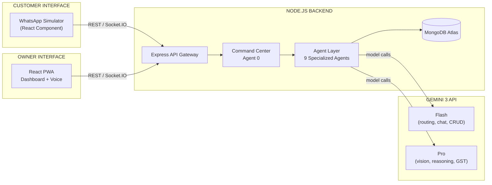
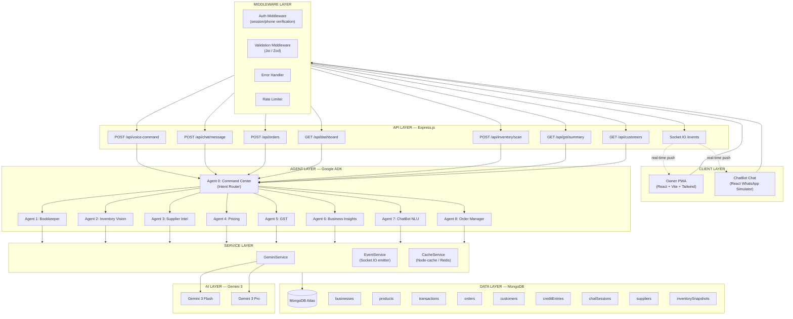
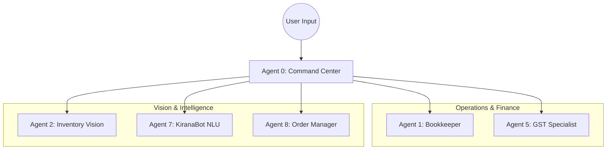

# 🛒 Datini

**The Multi-Agent AI Partner for the Indian Kirana Store.**

---

## 📜 The Story: From Prato, 1383 to Bengaluru, 2026

**Francesco di Marco Datini** (c. 1335–1410), the "Merchant of Prato," is a pivotal figure in economic history. In **1383**, he implemented the world's first true **business partnership system**, transforming how merchants collaborated, shared risk, and built trust. He left behind an archive of over 150,000 letters, proving that communication is the lifeblood of commerce.

**We named this project "Datini" to honor that legacy.**

Today, the Indian *Kirana* (grocery) store owner stands where Francesco did—at the center of their community's economy. But in the digital age, they often stand alone, overwhelmed by complex software and disconnected supply chains.

**Datini (the software)** is the modern reincarnation of Francesco's partnership system. It is not just a tool; it is an **AI Partner**. It listens, sees, and speaks, allowing the merchant to focus on their trade while the AI handles the ledger. Just as Francesco revolutionized business trust in the 14th century, Datini revolutionizes digital access for the informal economy of the 21st.

---

## 🚀 What is Datini?

Datini is a **two-sided, voice-first business operating system** powered by a swarm of **9 Specialized Gemini 3 Agents**. It bridges the gap between the chaotic reality of a physical store and the precision of digital commerce.

### 🗣️ Truly Multilingual & Polyglot

Datini breaks the language barrier. It doesn't just support English; it is natively fluent in the languages of Bharat.

* **For the Owner:** Voice-first command center supporting **Hindi, Kannada, Tamil, Telugu, English,** and mixed **Hinglish**.
* **For the Customer:** The **KiranaBot** NLU parses orders in natural, mixed-language text (e.g., *"2 kilo chawal aur ek packet milk, jaldi bhejo"*).

---

## 🌟 The Datini Experience

| Feature | The Old Way | The Datini Way |
| --- | --- | --- |
| **Data Entry** | Scribbling in paper ledgers (*Khata*) | **Voice-First:** *"Ramesh ko ₹500 ka udhar likh do."* |
| **Inventory** | Hours of manual counting | **Vision-Native:** Snap a photo of the shelf; AI counts the stock. |
| **Ordering** | Chaotic WhatsApp chats & missed calls | **KiranaBot:** Automated parsing, billing, and confirmation. |
| **Compliance** | Expensive accountants | **Agentic GST:** Real-time tax & Input Tax Credit (ITC) logs. |
| **Languages** | English-only interfaces | **Polyglot:** Hindi, Tamil, Telugu, Kannada, English, Hinglish. |


---
## UI examples 


---

## 🧠 The Intelligence: 9 Specialized Agents

Datini uses the **Google Agent Development Kit (ADK)** to orchestrate a team of AI specialists. We do not use a single generic model; we use a "Separation of Concerns" architecture to ensure accuracy.

### System overview

Clients (Owner PWA + ChatBot), backend (Express → Command Center → 9 agents), and Gemini 3.



### High-level architecture

Full stack: client layer, API/middleware, agent layer, services, data layer, and AI layer.





### 🛰️ The Orchestrator

* **Agent 0: Command Center** – The "Manager." It classifies intents from voice/text/image and routes them (e.g., a tax question goes to Agent 5, a shelf photo goes to Agent 2).

### 💼 The Finance Team

* **Agent 1: Bookkeeper** – Manages the ledger (*Khata*). Tracks credit (*Udhar*) and cash flow.
* **Agent 5: GST Specialist** – Mapped to HSN codes; calculates net payable tax and ITC automatically.

### 👁️ The Vision & Sales Team

* **Agent 2: Inventory Vision** – Uses **Gemini 3 Pro Vision** to count items on shelves from photos, detecting low stock and "phantom inventory."
* **Agent 7: KiranaBot** – A customer-facing NLU engine. It holds the conversation state, understands context ("add 2 more"), and generates the final bill.
* **Agent 8: Order Manager** – Manages the lifecycle: `Pending` → `Accepted` → `Out for Delivery` → `Delivered`.

---

## 🛠️ Technical Architecture

### **The Stack**

* **Frontend:** React PWA (Vite, Tailwind) + Web Speech API (for polyglot voice input).
* **Backend:** Node.js (Express) + Google ADK.
* **Database:** MongoDB Atlas (Time-series data for transactions).
* **AI Models:**
* **Gemini 3 Flash:** For low-latency chat and intent classification.
* **Gemini 3 Pro:** For complex reasoning, GST calculations, and Vision tasks.


* **Real-Time:** **Socket.IO** for instant order alerts and stock updates.

### **The Order Flow**

1. **Customer (WhatsApp UI):** Types *"Oru packet Aashirvaad atta, please"* (Tamil/English mix).
2. **KiranaBot (Agent 7):** Identifies item, checks stock via Agent 2, and replies *"Available via. ₹60. Confirm?"*
3. **Customer:** *"Ok."*
4. **Order Manager (Agent 8):** Creates Order `#KRN-99` and pushes a **Socket.IO** event to the Owner's dashboard.
5. **Owner (PWA):** Sees the alert, taps "Accept," and speaks *"Raju, delivery ke liye jao."*

---

## ⚡ Getting Started

### Prerequisites

* Node.js v18+
* MongoDB Atlas URI
* Google AI Studio API Key

### Installation

1. **Clone the repository**
```bash
git clone https://github.com/AdityaKrSingh26/Datini.git
cd Datini

```


2. **Install Dependencies**
```bash
npm install         # Backend dependencies
cd client && npm install # Frontend dependencies

```


3. **Configure Environment**
Create a `.env` file in the root directory:
```env
PORT=3001
MONGO_URI=your_mongodb_connection_string
GEMINI_API_KEY=your_google_ai_key

```


4. **Run the Application**
```bash
# Start Backend
npm run server

# Start Client (in new terminal)
npm run client

```


---

## 🤝 Contributing

We welcome contributions, especially those adding support for more regional languages (Marathi, Bengali, Gujarati, Malayalam) to our NLU pipeline.

## 📄 License

This project is licensed under the MIT License - see the [LICENSE](https://www.google.com/search?q=LICENSE) file for details.

---

<p align="center">
<i>Inspired by Francesco Datini (1383). Built for Bharat (2026).</i>
</p>
