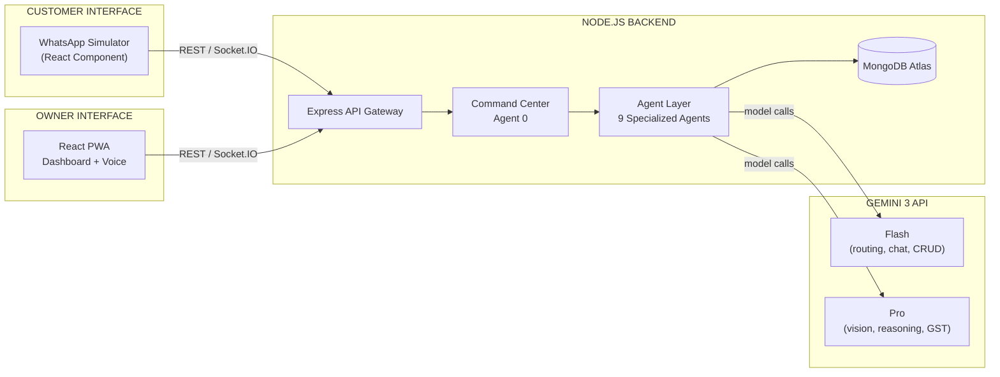
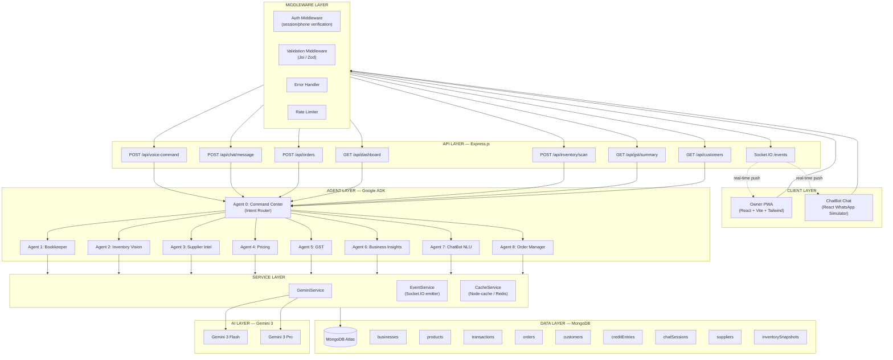
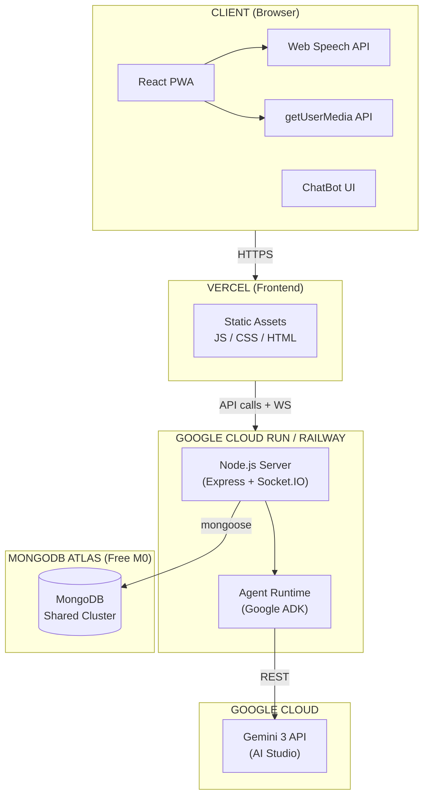
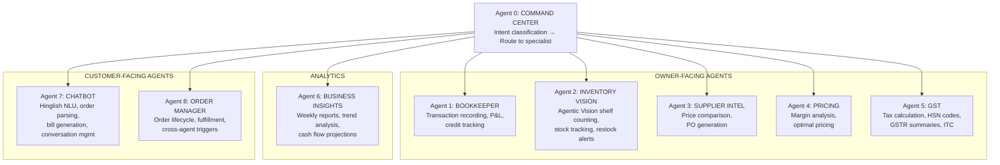
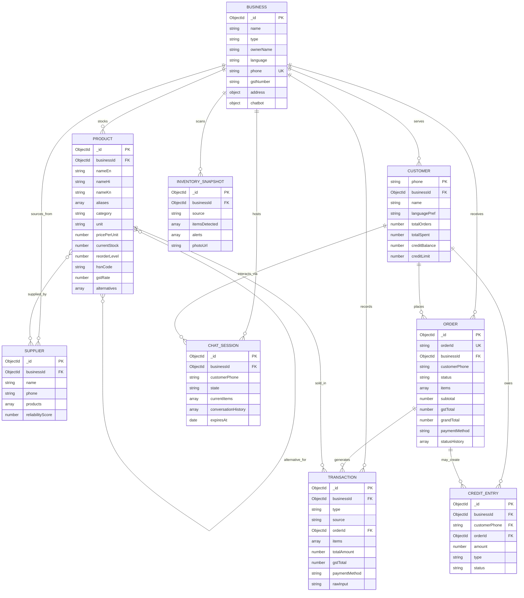

# Datini — Documentation

Documentation for **Datini**, a two-sided multi-agent business copilot for Indian kirana (grocery) stores.

---

## What is Datini?

Datini helps small kirana store owners and their customers through:

- **Owner interface** — React PWA with voice-first input, camera-based inventory scanning, and a unified dashboard (P&L, orders, GST, credit, insights).
- **Customer interface** — **KiranaBot**, a WhatsApp-style conversational ordering system with **Hinglish/Indian-language NLU** (Hindi, English, Kannada, Tamil, Telugu).
- **Intelligence layer** — **9 specialized Gemini 3 agents** orchestrated via **Google ADK** with Agent-to-Agent (A2A) communication.
- **Backend** — Node.js + Express + MongoDB + Socket.IO.

**Target users:** Small kirana store owners (often low-literacy, mobile-first) and their customers who order via chat.

---

## Features at a glance (for non-technical users)

_Use this section to showcase Datini to store owners, customers, judges, or stakeholders—no tech jargon._

### For store owners

- **Talk to your business** — Use your voice in Hindi, Kannada, English, or Hinglish. Say “Aaj kitna becha?” or “Meena aunty ko 2 kilo chawal udhar diya” and the app records it. No typing needed.
- **One screen for everything** — See today’s sales, expenses, profit, pending orders, low-stock alerts, GST status, and who owes you money—all on one dashboard that updates live.
- **Scan shelves with your phone** — Point your camera at the shelf; the app counts items, matches them to your products, and tells you what’s low or out of stock so you know when to reorder.
- **Accept or reject orders in one tap** — New customer orders appear instantly. Accept, reject, or mark “out for delivery” / “delivered” without leaving the app.
- **GST made simple** — Get a clear summary: how much GST you’ve collected, input credit (ITC), what you owe, and when it’s due. No need to juggle spreadsheets.
- **Know who owes you (udhar)** — See each customer’s credit balance and send a friendly reminder with one tap. Get notified when a reminder has been sent.
- **Weekly business snapshot** — One-tap weekly report: daily sales, best-selling items, trends, and cash flow so you can plan better.
- **Smarter buying** — Compare supplier prices when you’re low on stock and get simple purchase-order suggestions. Get pricing tips to protect your margins.
- **Instant alerts** — Get notified the moment a new order comes in, when stock is low, or when the day’s summary is ready—no need to keep refreshing.

### For customers

- **Order like chatting on WhatsApp** — Open the chat, type or speak in your language (Hindi, Hinglish, Kannada, Tamil, Telugu). Example: “2 kilo chawal aur do packet Maggi dedo.”
- **Understands how you speak** — Say “chawal”, “tel”, “atta”—the bot knows you mean rice, oil, flour. It responds in the same language and keeps the tone respectful (aap).
- **See your bill before confirming** — Get an item-wise bill in ₹. Say “Haan” to confirm or “Na” to cancel or change the order. No surprises.
- **Out-of-stock? Get an alternative** — If something isn’t available, the bot suggests one similar product so you can decide quickly.
- **Track your order** — Get updates in the chat when the store accepts your order, when it’s out for delivery, and when it’s delivered.

### Why it’s different

- **Built for Indian kirana** — Language, terms (udhar, khata, baki, nagad, UPI), GST, and workflows match how small stores actually work.
- **Voice-first for owners** — Ideal for busy or less literate users; you can run the store by speaking.
- **One place for shop and chat** — Owners see orders and dashboard; customers get a familiar chat experience—both stay in sync in real time.

---

## Features (detailed)

### Owner interface (PWA)

| Area                      | Features                                                                                                                                                                                                                                                                                                                                                                                                    |
| ------------------------- | ----------------------------------------------------------------------------------------------------------------------------------------------------------------------------------------------------------------------------------------------------------------------------------------------------------------------------------------------------------------------------------------------------------- |
| **Voice commands**        | Speak in Hindi, Kannada, English, or Hinglish (Tamil, Telugu planned). Command Center classifies intent and routes to the right agent. Supported intents: **record_sale**, **record_expense**, **check_inventory**, **scan_shelf**, **gst_query**, **credit_query**, **weekly_report**, **supplier_query**, **pricing_query**, **dashboard_query**. Optional TTS (SpeechSynthesis or Gemini) for responses. |
| **Dashboard**             | Unified view: P&L (sales, expenses, profit), stock alerts (low/out-of-stock), pending orders count, GST status (collected, ITC, net payable, next due date), credit summary (who owes, totals). Real-time updates via Socket.IO.                                                                                                                                                                            |
| **Orders**                | List orders by status (pending/active/completed); create order (manual/phone); accept, reject, or mark delivered via **PATCH /api/orders/:id/status**. Real-time **new_order** and **order_status_changed** events. Order ID format: `KRN-YYYY-XXXX`.                                                                                                                                                       |
| **Inventory**             | Product list with current stock, reorder levels; **camera-based shelf scan** (upload image → Gemini Pro vision counts items, matches catalog, compares to `currentStock`). Alerts: low stock, out-of-stock, discrepancy. Restock alerts and optional Supplier Intel / PO when stock &lt; reorderLevel.                                                                                                      |
| **GST**                   | Tax calculation, HSN code mapping, GSTR-style summaries, input tax credit (ITC). Rates by category (0/5/12/18/28%). **GET /api/gst/summary** returns gstCollected, itc, netPayable, nextDueDate.                                                                                                                                                                                                            |
| **Customers**             | List customers with total orders, total spent, credit balance, credit limit, last order. **Send reminder** for credit (POST /api/customers/:id/remind). Real-time **credit_reminder_sent** event.                                                                                                                                                                                                           |
| **Business insights**     | Weekly report (daily sales, top products, trends, cash flow, anomalies). Uses Business Insights agent (Pro, high context). **GET /api/insights/weekly**.                                                                                                                                                                                                                                                    |
| **Supplier & pricing**    | Supplier Intel: price comparison across suppliers, reorder context, PO generation. Pricing agent: margin analysis, optimal pricing recommendations.                                                                                                                                                                                                                                                         |
| **Real-time (Socket.IO)** | Owner joins room `business:{businessId}`. Events: **new_order**, **order_status_changed**, **stock_alert**, **daily_summary**, **credit_reminder_sent**.                                                                                                                                                                                                                                                    |

### Customer interface (KiranaBot)

| Area               | Features                                                                                                                                                                                                                                                                                                                     |
| ------------------ | ---------------------------------------------------------------------------------------------------------------------------------------------------------------------------------------------------------------------------------------------------------------------------------------------------------------------------- | ---------- | ----------------------------------- | --------- | ---------------- |
| **Chat UI**        | WhatsApp-style conversational UI (React component). Customer identifies by phone; session stored in MongoDB (`ChatSession`) with 30-min TTL.                                                                                                                                                                                 |
| **Languages**      | Hinglish/Indian-language NLU: Hindi, English, Kannada, Tamil, Telugu. Bot responds in same language; formal “aap”; 2–3 emojis; &lt;200 words.                                                                                                                                                                                |
| **Intents**        | **Greeting**, **order** (add items), **confirm**, **cancel**, **modify**, **credit_request**, **unclear**. NLU pipeline: language detection → intent → entity extraction (items, qty, units) → alias matching (e.g. chawal→rice, tel→oil) → catalog lookup → inventory check (Agent 2) → bill or clarification/alternatives. |
| **Order flow**     | Customer says items in natural language → bot shows **itemized bill** (₹) → “Confirm? (Haan/Na)”. On confirm → Order Manager creates order (PENDING). If item OOS → suggest one alternative; no hallucinated products.                                                                                                       |
| **Session states** | IDLE → GREETING → AWAITING_ORDER → PARSING → SHOWING_BILL                                                                                                                                                                                                                                                                    | CLARIFYING | SUGGESTING_ALTERNATIVES → CONFIRMED | CANCELLED | MODIFYING_ORDER. |
| **Real-time**      | Customer joins room `session:{sessionId}`. Event **order_status_changed** (e.g. accepted, out for delivery, delivered).                                                                                                                                                                                                      |

### Order processing pipeline

| Stage         | Description                                                                                                                                                                                                   |
| ------------- | ------------------------------------------------------------------------------------------------------------------------------------------------------------------------------------------------------------- | ----------------------------------------------------------------------------------------- |
| **Lifecycle** | CREATED → PENDING (KiranaBot confirm) → ACCEPTED                                                                                                                                                              | REJECTED (owner) → PREPARING → OUT_FOR_DELIVERY → DELIVERED → COMPLETED (e.g. after 24h). |
| **On accept** | In parallel: Bookkeeper records sale, Inventory deducts stock, GST calculated for order, customer notified via Socket.IO. If any product stock &lt; reorderLevel → Supplier Intel / **stock_alert** to owner. |
| **Order ID**  | Unique `KRN-YYYY-XXXX` (e.g. KRN-2026-0042), generated via Counter collection.                                                                                                                                |

### Agent layer (9 agents, Google ADK + A2A)

| Agent                     | Role                                                                                                                                             |
| ------------------------- | ------------------------------------------------------------------------------------------------------------------------------------------------ |
| **0 – Command Center**    | Intent classification from owner voice/text; routes to specialist; output `{intent, agentId, params}`.                                           |
| **1 – Bookkeeper**        | Record sales/expenses from natural language; P&L; credit tracking; today’s summary. Understands Indian terms: udhar, khata, baki, nagad, UPI.    |
| **2 – Inventory Vision**  | Agentic vision: shelf photo → count items, match catalog (Product.findByAlias), compare to currentStock; restock alerts. Pro + ULTRA_HIGH media. |
| **3 – Supplier Intel**    | Price comparison across suppliers, reorder context, PO generation. Triggered when stock &lt; reorderLevel.                                       |
| **4 – Pricing**           | Margin analysis, optimal pricing recommendations.                                                                                                |
| **5 – GST**               | Tax calculation, HSN codes, GSTR summaries, ITC.                                                                                                 |
| **6 – Business Insights** | Weekly reports, trends, cash flow; can use large context (e.g. 1M). Pulls from Bookkeeper, Inventory, GST, Order Manager.                        |
| **7 – KiranaBot**         | Hinglish NLU: parse order, alias→productId, bill generation, conversation state (ChatSession). Calls Inventory for availability before bill.     |
| **8 – Order Manager**     | Order lifecycle (create, accept, reject, dispatch, deliver); triggers Bookkeeper, Inventory, GST, and notifications via A2A.                     |

### API surface (summary)

| Method | Endpoint                    | Purpose                                                                  |
| ------ | --------------------------- | ------------------------------------------------------------------------ |
| POST   | `/api/voice-command`        | Owner voice/text → `{ audioText, language }` → `{ data, responseText }`. |
| POST   | `/api/kiranabot/message`    | Customer chat → `{ phone, text }` → `{ botMessage, sessionState }`.      |
| GET    | `/api/dashboard`            | P&L, stock alerts, pending orders, GST status, credit summary.           |
| GET    | `/api/orders`               | List orders (optional `?status=pending`).                                |
| POST   | `/api/orders`               | Create order (manual/phone).                                             |
| PATCH  | `/api/orders/:id/status`    | Accept, reject, or deliver order.                                        |
| GET    | `/api/inventory`            | Product list with stock levels.                                          |
| POST   | `/api/inventory/scan`       | Camera scan → `{ image: base64 }` → `{ itemsDetected[], alerts[] }`.     |
| GET    | `/api/gst/summary`          | GST collected, ITC, net payable, next due date.                          |
| GET    | `/api/customers`            | List customers (credit, orders, spent).                                  |
| POST   | `/api/customers/:id/remind` | Send credit reminder.                                                    |
| GET    | `/api/insights/weekly`      | Weekly report (daily sales, top products, trends, cash flow).            |

### Real-time events (Socket.IO)

| Event                  | Audience | Payload (conceptual)                  |
| ---------------------- | -------- | ------------------------------------- |
| `new_order`            | Owner    | orderId, customer, total, items       |
| `order_status_changed` | Customer | orderId, status, message              |
| `stock_alert`          | Owner    | productId, currentStock, reorderLevel |
| `daily_summary`        | Owner    | sales, expenses, profit, topProducts  |
| `credit_reminder_sent` | Owner    | customerId, amount                    |

---

## Architecture Diagrams

_Diagrams are sourced from [architecture.md](./architecture.md). They render in GitHub, GitLab, and any Mermaid-compatible viewer._

### System overview

Clients (Owner PWA + ChatBot), backend (Express → Command Center → 9 agents), and Gemini 3.

### High-level architecture

Full stack: client layer, API/middleware, agent layer, services, data layer, and AI layer.

### Deployment architecture

Browser clients, Vercel (frontend), Cloud Run/Railway (backend), MongoDB Atlas, and Gemini API.

### Agent topology (9 agents)

Command Center routes to owner-facing agents (Bookkeeper, Inventory Vision, Supplier, Pricing, GST), Business Insights, and customer-facing agents (ChatBot, Order Manager).

### Data model (entity–relationship)

Core MongoDB collections and relationships (Business, Product, Order, Customer, Transaction, ChatSession, etc.).

---

## Documentation Index

| Document                                   | Purpose                                                                                                                                                                                                                                                                                                                                             |
| ------------------------------------------ | --------------------------------------------------------------------------------------------------------------------------------------------------------------------------------------------------------------------------------------------------------------------------------------------------------------------------------------------------- |
| **[architecture.md](./architecture.md)**   | Full technical architecture: system overview, agent topology, API design, MongoDB schema, Gemini integration, voice/inventory pipelines, Socket.IO events, prompt engineering, tech stack, backend structure, test cases, seed data, and frontend generation prompt.                                                                                |
| **[SYSTEM_PROMPT.md](./SYSTEM_PROMPT.md)** | Single source of truth for AI assistants (Cursor, Claude, etc.) and developers: product identity, architecture summary, tech stack, agent roles, A2A flows, KiranaBot state machine, order pipeline, data model, API surface, real-time events, prompt principles, project structure, and conventions. Use as system context before implementation. |

### Phase Plans (Implementation Guides)

Phased build plans with agent context, structure, and acceptance criteria:

| Phase | File                                                                     | Focus                                                                                |
| ----- | ------------------------------------------------------------------------ | ------------------------------------------------------------------------------------ |
| 1     | [plan-phase1-foundation.md](./plan-phase1-foundation.md)                 | Project scaffolding, MongoDB connection, 9 Mongoose models, seed data, server entry  |
| 2     | [plan-phase2-services-agents.md](./plan-phase2-services-agents.md)       | Services (Gemini, Event, Cache), agent base, Command Center                          |
| 3     | [plan-phase3-owner-agents.md](./plan-phase3-owner-agents.md)             | Owner-facing agents (Bookkeeper, Inventory Vision, Supplier, Pricing, GST, Insights) |
| 4     | [plan-phase4-chatbot-orders.md](./plan-phase4-chatbot-orders.md)         | KiranaBot (Agent 7), Order Manager (Agent 8), ChatSession, order lifecycle           |
| 5     | [plan-phase5-api-realtime.md](./plan-phase5-api-realtime.md)             | REST routes, Socket.IO, validation, auth                                             |
| 6     | [plan-phase6-frontend.md](./plan-phase6-frontend.md)                     | React PWA, dashboard, voice, inventory scan, KiranaBot UI                            |
| 7     | [plan-phase7-integration-deploy.md](./plan-phase7-integration-deploy.md) | Integration, E2E, deployment (Vercel, Cloud Run/Railway, MongoDB Atlas)              |

---

## Tech Stack (Summary)

| Layer      | Technology                                             |
| ---------- | ------------------------------------------------------ |
| Runtime    | Node.js 20 LTS                                         |
| Backend    | Express 4.x, Socket.IO 4.x                             |
| Database   | MongoDB Atlas (M0), Mongoose 8.x                       |
| AI         | Gemini 3 (Flash + Pro) via @google/genai               |
| Agents     | Google ADK (JS), 9 specialized agents                  |
| Validation | Zod 3.x                                                |
| Frontend   | React 18, Vite, Tailwind, Web Speech API, getUserMedia |
| Deploy     | Vercel (frontend), Cloud Run / Railway (backend)       |

---

## Quick Reference

- **API base:** `http://localhost:3001` (or `process.env.API_URL`)
- **Key endpoints:** `POST /api/voice-command`, `POST /api/kiranabot/message`, `GET /api/dashboard`, `GET /api/orders`, `POST /api/inventory/scan`, `GET /api/gst/summary`, etc.
- **Socket.IO:** Namespace `/events`; events: `new_order`, `order_status_changed`, `stock_alert`, `daily_summary`, `credit_reminder_sent`
- **Order ID format:** `KRN-YYYY-XXXX` (e.g. `KRN-2026-0042`)

---

## Using This Documentation

1. **Implementing features** — Start with [SYSTEM_PROMPT.md](./SYSTEM_PROMPT.md) for context, then use [architecture.md](./architecture.md) for schemas, sequences, and boilerplate.
2. **Building from scratch** — Follow phases 1 → 7 in order; each plan includes agent context, structure, and acceptance criteria.
3. **AI-assisted development** — Feed [SYSTEM_PROMPT.md](./SYSTEM_PROMPT.md) (and relevant architecture sections) as system context to Cursor, Claude, or similar tools.

---

_Datini — Technical Architecture v3.0 · Last updated: February 2026_
